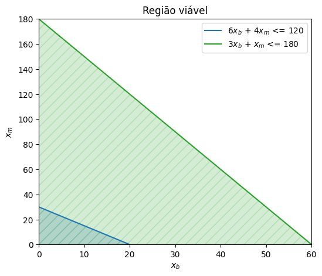

# Exercício de programação linear

## Problema

Um fabricante produz bicicletas e motoretas, devendo cada uma delas ser processada em duas oficinas.  
A oficina 1 tem um máximo de 120 hora de trabalho disponível e a oficina 2 um máximo de 180 h.  
O fabrico de uma bicicleta requer 6 hora de trabalho na oficina 1 e 3 h na oficina 2.  
O fabrico de uma motoreta requer 4 h na oficina 1 e 1 hora na oficina 2.  
O lucro é de 30 € por bicicleta e de 40 € por motoreta.  
Formule o problema da determinação do plano de produção como sendo de programação linear, de modo a maximizar o lucro.

## Resolução

### Apresentação dos dados

|                 | Oficina 1 | Oficina 2 | Lucro |
|:----------------|----------:|----------:|------:|
| Bicicleta       | 6 h       | 3 h       | € 30  |
| Motoreta        | 4 h       | 1 h       | € 40  |
| Disponibilidade | 120 h     | 180 h     |       |

### Variáveis de decisão

$x_b$ = número de bicicletas produzidas  
$x_m$ = número de motoretas produzidas

### Função problema

$$
\begin{aligned}
\text{Max}\ \mathbb{Z}=30x_b + 40x_m
\end{aligned}
$$

### Sujeito a

$$
\begin{aligned}
6x_b + 4x_m \le 120 \\
3x_b + x_m \le 180 \\
x_b, x_m \in \mathbb{R}^+
\end{aligned}
$$

## Solução ótima

A solução ótima estará em um dos vértices da região viável.

### Gráfico da solução

### Resultado

Aplicando a função objetivo em cada vértice, temos:

| Vértice | Função objetivo |
|:-------:|----------------:|
| (0,0)   | 0               |
| (0,180) | 7.200           |
| (60,0)  | 1.800           |

**Verifica-se que o melhor resultado está em se produzir, exclusivamente, 180 motoretas na Oficina 2.**
